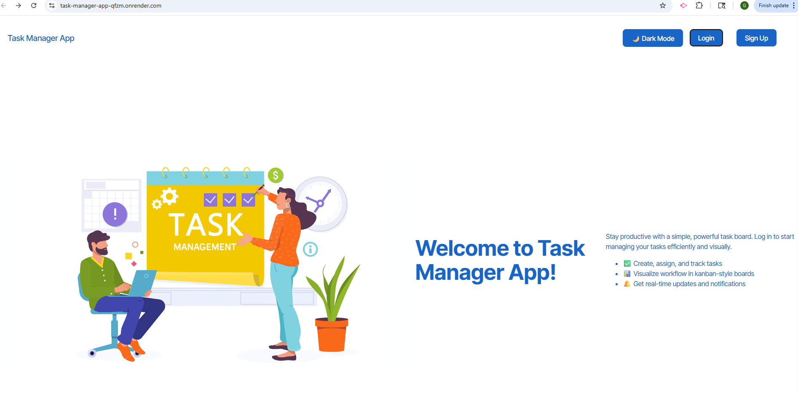
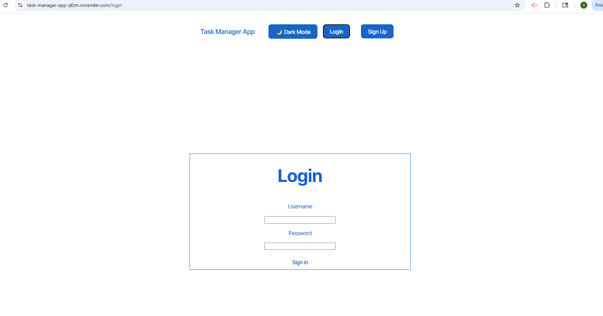
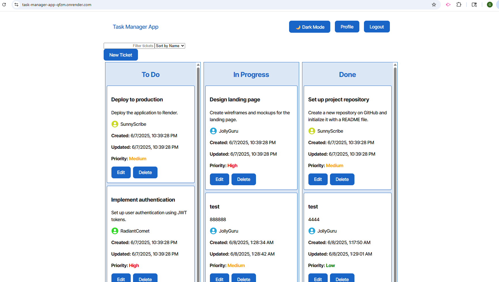

# Task-Manager-App (Kanban Board) [](https://opensource.org/licenses/MIT)

> **A modern, full-stack Kanban board for teams and individuals.**

---

## Description

**Task-Manager-App** is a robust Kanban board application for managing tasks and tickets with a modern, responsive UI. It features secure authentication using JSON Web Tokens (JWT), user profile avatars, ticket priorities, and real-time updates. Designed for teams and individuals who want a simple yet powerful workflow tool.

---

## Table of Contents

- [Description](#description)
- [Technologies Used](#technologies-used)
- [Features](#features)
- [Getting Started](#getting-started)
- [Usage](#usage)
- [Deployment](#deployment)
- [Screenshots](#screenshots)
- [License](#license)
- [Contribution Guidelines](#contribution-guidelines)
- [Test Instructions](#test-instructions)
- [Contact](#contact)

---

## Technologies Used

- **Frontend:** React, TypeScript, Vite, Apollo Client, React Router, CSS Modules
- **Backend:** Node.js, Express, Apollo Server, MongoDB, Mongoose, JWT
- **Testing:** Vitest, React Testing Library, Cypress
- **Other:** Render (deployment), dotenv, bcrypt

---

## Features

- Secure login and logout using JWT
- User profile page with colorful avatar
- Task management with filtering, sorting, and priority coloring
- Real-time ticket updates after creation or edit
- Responsive and user-friendly interface

---

## Getting Started

1. **Clone the repository:**
   ```bash
   git clone <repository-url>
   cd Task-Manager-App
   ```

2. **Install dependencies:**
   ```bash
   cd server && npm install
   cd ../client && npm install
   ```

3. **Set up the `.env` file in the `server` directory:**
   ```properties
   MONGODB_URI=your-atlas-uri-here
   MONGODB_DB=kanban_db
   JWT_SECRET_KEY=your-secret-key
   PORT=3001
   ```

4. **Seed the database:**
   ```bash
   cd server
   npm run seed
   ```

5. **Start the development server:**
   ```bash
   cd server && npm run dev
   cd ../client && npm run dev
   ```

---

## Usage

1. Open the application in your browser at [http://localhost:5173](http://localhost:5173).
2. Sign up or log in.
3. Create, edit, and manage your tasks on the Kanban board.
4. Click your profile to view your avatar and user info.

---

## Deployment

**Live Demo:**  
👉 [https://task-manager-app-qfzm.onrender.com/](https://task-manager-app-qfzm.onrender.com/)

---

## Screenshots

| Home | Login | Kanban Board |
|------|-------|--------------|
|  |  |  |

---

## License

Project license: MIT  
[](https://opensource.org/licenses/MIT)

---

## Contribution Guidelines

Permission is hereby granted, free of charge, to any person obtaining a copy of this software and associated documentation files (the "Software"), to deal in the Software without restriction, including without limitation the rights to use, copy, modify, merge, publish, distribute, sublicense, and/or sell copies of the Software, and to permit persons to whom the Software is furnished to do so.

---

## Test Instructions

Tests are written with Vitest and React Testing Library.  
To run tests:
```bash
cd client
npm run test
```

---

## Contact

If you have any questions, please feel free to contact me at gamalmubarak87@gmail.com.  
You can also find more of my work at [gamalmubarak](https://github.com/gamalmubarak).
